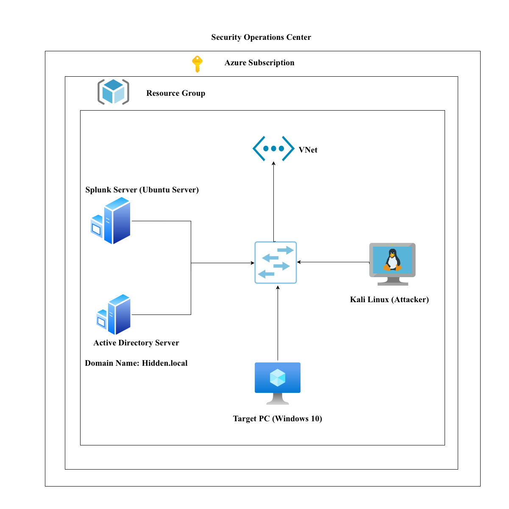
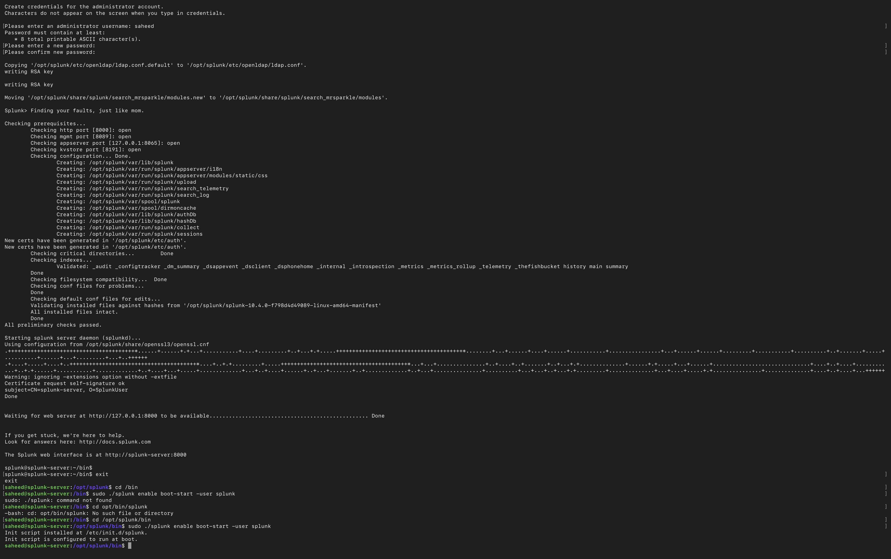
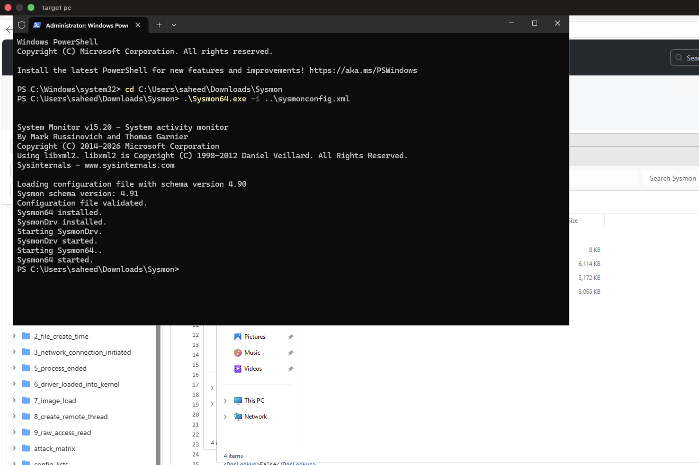
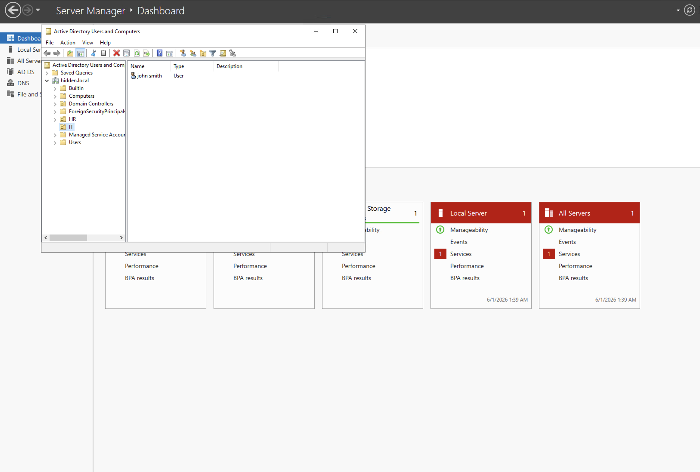
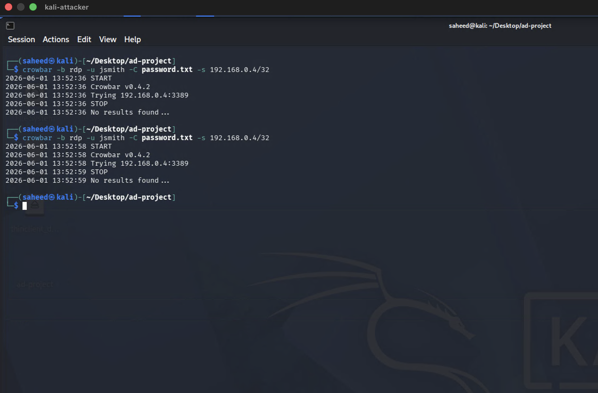
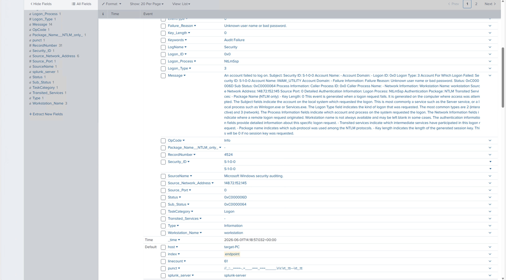
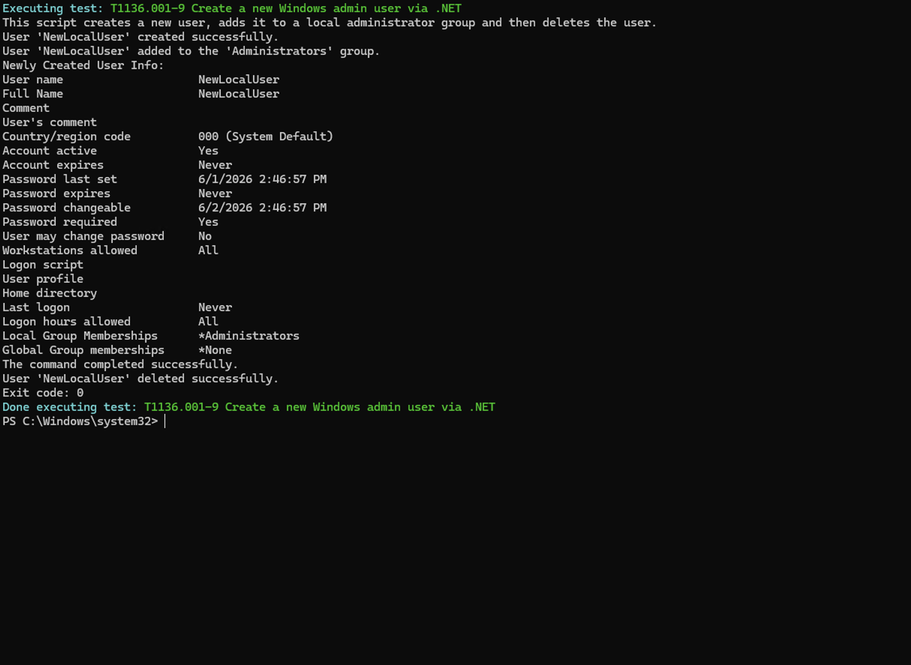
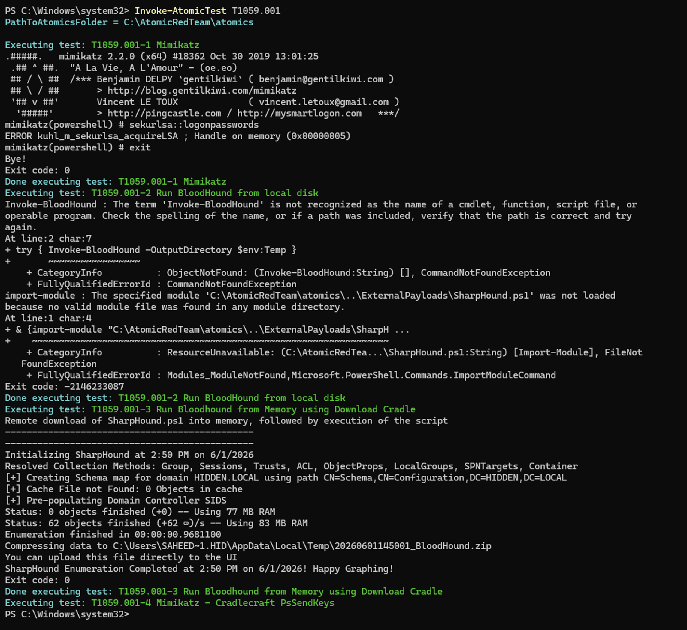

# Active Directory & SIEM Security Monitoring Lab (Splunk + Atomic Red Team)

---

## Overview

In this project, I built a full Active Directory environment in Microsoft Azure to simulate a realistic enterprise network for security monitoring and attack analysis.

The environment consisted of a Domain Controller, a Windows 10 target machine, a Splunk SIEM server, and a Kali Linux attacker machine. The goal was to understand how enterprise networks generate security telemetry and how SIEM tools like Splunk can be used to collect, analyse, and correlate security events.

Throughout this lab, I configured Active Directory, deployed endpoint logging using Sysmon and Splunk Universal Forwarder, and simulated real-world attack techniques such as brute-force authentication attempts and adversary emulation using Atomic Red Team. The resulting telemetry was analysed in Splunk to identify malicious behaviour and understand detection patterns.

---

## Security Context

Enterprise Active Directory environments are a primary target for attackers due to their central role in identity management and access control.

Without proper logging, monitoring, and SIEM integration, malicious activities such as brute-force attacks, lateral movement, and privilege escalation can go undetected.

This project was designed to demonstrate how Splunk, combined with endpoint telemetry tools like Sysmon and adversary simulation frameworks like Atomic Red Team, can be used to monitor, detect, and analyse real-world attack behaviour in an Active Directory environment.

---

## 🛠️ Technologies & Tools Used

  

  

  

  

  

  

  

## Lab Architecture & Assets

All infrastructure was deployed in Microsoft Azure.

- Windows Server (Domain Controller): `192.168.0.5`
- Splunk Server (Ubuntu): `192.168.0.6`
- Windows 10 Target Machine: `192.168.0.4`
- Kali Linux Attacker Machine: `192.168.0.7`

📌 Architecture Diagram

---

## Environment Setup

### 1. Splunk Deployment

Installed Splunk Enterprise on the Ubuntu server to act as the central SIEM platform for log ingestion and analysis.

📌 Splunk Setup

---

### 2. Endpoint Logging Configuration

To enable telemetry collection across the environment, I installed and configured:

- Splunk Universal Forwarder (Windows endpoints)
- Sysmon for detailed event logging

Logs were forwarded to the Splunk server, where a dedicated index was created for endpoint security data. Successful log ingestion was verified from both the Domain Controller and the Windows 10 machine.

📌 Endpoint Configuration

---

### 3. Active Directory Setup

The Windows Server was promoted to a Domain Controller, establishing a full Active Directory environment.

Configuration steps included:

- Creating a new domain
- Setting up Organizational Units (OUs)
- Creating domain users
- Joining the Windows 10 machine to the domain

This created a realistic enterprise identity and authentication structure.

📌 Active Directory Setup

---

## Attack Simulation

### 1. Brute Force Attack (Kali Linux)

Using Kali Linux, I performed a brute-force attack against a domain user account (`john.smith`) using Crowbar and a custom password list.

This generated multiple authentication failures within the Active Directory environment.

📌 Brute Force Attack

---

### 2. Detection in Splunk

The brute-force activity was detected in Splunk by filtering:

- Event ID 4625 (Failed Logon Attempts)

This allowed analysis of:

- Source IP address
- Failed login frequency
- Targeted user accounts

📌 Splunk Detection

---

## Atomic Red Team Simulation

To simulate adversary behaviour beyond brute-force attacks, I used Atomic Red Team mapped to the MITRE ATT&CK framework.

### Tests Performed:

- T1136 → Create Local Account
- T1059.001 → Command and Scripting Interpreter (PowerShell)

These simulations generated realistic endpoint telemetry for detection validation.

📌 Atomic Red Team Execution

---

## Log Analysis in Splunk

A key event observed during Atomic Red Team execution was a new process creation triggered via PowerShell.

The log captured:

- Process execution via Splunk Universal Forwarder
- PowerShell-based activity
- Elevated token behaviour under Windows security policy

📌 Process Execution Logs

---

## Key Findings

- Active Directory environments generate high-value security telemetry when properly configured
- Splunk effectively correlates authentication and endpoint events
- Brute-force attacks are clearly visible through Event ID 4625 logs
- Sysmon significantly improves endpoint visibility
- Atomic Red Team is effective for validating detection coverage
- SIEM tools are critical for real-time threat detection and investigation

---

## MITRE ATT&CK Mapping

- T1110 → Brute Force Attack
- T1078 → Valid Accounts
- T1136 → Account Creation
- T1059.001 → PowerShell Execution

---

## Conclusion

This project demonstrated how a fully configured Active Directory environment can be used to simulate real enterprise attack scenarios and generate meaningful security telemetry.

By combining Splunk, Sysmon, Active Directory, and adversary simulation tools, I was able to observe how attacks manifest in logs and how they can be detected and analysed in a SIEM environment.

This lab strengthened my understanding of:
- Enterprise identity security
- SIEM-based monitoring and detection
- Endpoint telemetry analysis
- Attack simulation and threat emulation
